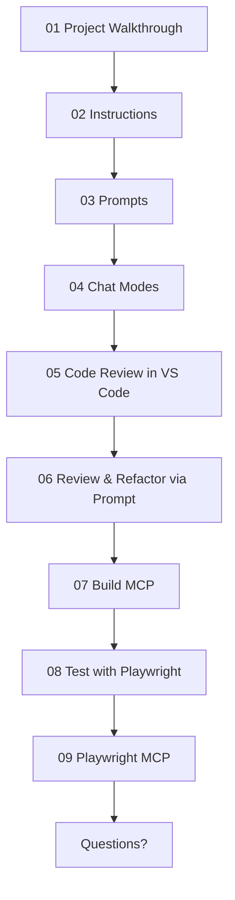

**What We"ll Cover:**

### Demo 1: Instructions, Prompts, Modes
- [ ] [01 Project Walkthrouhg](prompts/01-project-overview.md): Quick walkthrough of the project using Copilot + Running the FE/BE
- [ ] [02 Instructions](prompts/02-generate-instructions.md): Generate copilot instructions for this project - using Copilot
- [ ] [03 Prompts](prompts/11.1-api-security-review.prompt.md): use task-specific prompt to review the APIs for Security issues
- [ ] 04 Chat Modes: Review several modes: [Plan](chatmodes/Plan.chatmode.md), [Debug](agents/Debug.agent.md), [4.1-Beast](chatmodes/4.1-Beast-v3.1.chatmode.md)

### Demo 2: Code Review
- [ ] [05 Code Review in VS Code](prompts/12-code-review-vs-code.md): review selection + review uncommited changes
- [ ] [06 Review & Refactor via Prompt](prompts/13-review-and-refactor.prompt.md): works in all IDEs

### Demo 3: CLI, Agent & MCP
- [ ] GitHub CLI - /help, add docs to App.js
- [ ] [07 Build MCP](prompts/04-create-superheroes-mcp.prompt.md): Create a Superheroes MCP to better understand the Superhero data schema
- [ ] [08 QA Playwright Tests](prompts/08-adding-e2e-playwright-tests.md): Generate frontend Playwrite tests (as AI TDD)
- [ ] [09 QA Playwright MCP + Chat Mode](prompts/09-a-playwright-mcp-with-chatmode-vsc.md): use Playwrite MCP to add edge cases

**See below tips & best practices**

---

**Key Tips & Best Practices:**
- [x] Context: Start a NEW session for every new task/topic!
- [x] Customize: via instructions, prompts (all IDEs) + chatmodes (VS Code)
- [x] Customize: Awesome prompts+MCPs repo at https://promptboost.dev
- [x] Agent: Use (or building) MCPs where it makes sense
- [x] Agent: Never "Accpet" until happy
- [x] Agent: Restore Checkpoint
- [x] Agent: TDD (Test Driven Dev) as Agent stop condition and feedback loop
- [x] Agent: should run CLI commands to close feedback loop
- [x] Models: Choosing the right models: https://docs.github.com/en/copilot/reference/ai-models/model-comparison
- [x] Review: Use AI for reviewing code, not just generating it