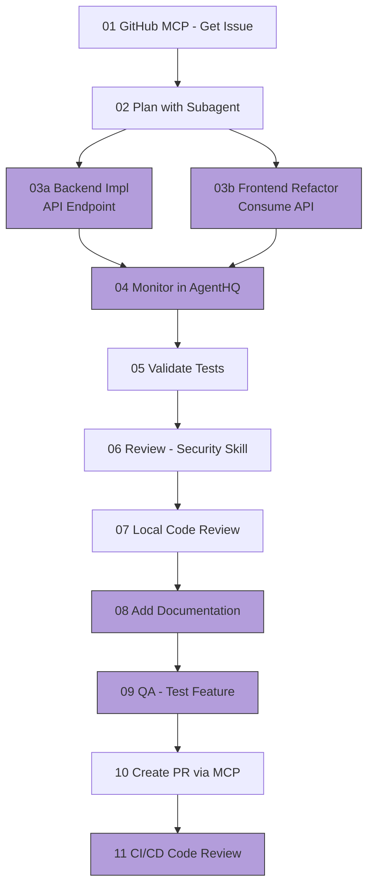

# Demo - Agentic Coding Workflow

**Pre-requisites:**
- [ ] Fork and clone the repo
- [ ] Copy this file to an ignored location like `.vscode/DEMOFLOW3.md` and open it there
- [ ] Create a GitHub issue in your forked repo with title: "Refactor superhero comparison feature to use a Backend API instead of Frontend logic", and make sure it's issue #21 - if not, update the prompts below accordingly
- [ ] No local changes, clean working tree
- [ ] Make sure Agent Skills are enabled (with the chat.useAgentSkills setting)
- [ ] Verify GitHub MCP and Playwright MCP are properly configured in mcp.json before starting: [.vscode/mcp.json](../.vscode/mcp.json)
- [ ] Start backend and frontend dev servers.

## What We'll Cover
We will implement a feature from idea to production using an agentic coding workflow with GitHub Copilot.
The feature is to refactor the superhero comparison logic to use a backend API instead of frontend logic.
Let's see the feature as it's currently implemented.

<div style="text-align: center;">



</div>

- [ ] **01 GitHub MCP**: List issues in GitHub using MCP
Issue name: Refactor superhero comparison feature to use a Backend API instead of Frontend logic
- [ ] **02 Create a Plan**: Create a step by step plan (with separate instructions for FE and BE) to implement the feature using Copilot subagent to do research before drafting the plan.
Save the plan to use in later steps.
Note: this allows for better, more concise context and plan quality.

    **Sample Prompt (use Plan mode):**
    ```
    Using subagents for research, analyze GitHub issue #21 "Refactor superhero comparison feature to use a Backend API instead of Frontend logic".

    Create a detailed implementation plan that should include:
    1. Backend: New /api/superheroes/compare endpoint (see prompts/10-BE-refactor-add-compare-api.md for API spec)
    2. Frontend: Refactor to consume the new API, keep UI unchanged
    3. Test coverage requirements for both

    Output the plan in markdown format I can save and reference in later steps.
    ```

    📄 **Backup Plan Document**: [prompts/15-refactor-be-fe-feature-plan.md](prompts/15-refactor-be-fe-feature-plan.md)


- [ ] **03 Implement Feature using Background Agents FE/BE**: Implement the feature using Background Agents (FE + BE in parallel)

**Backend Prompt (Sonnet 4.5 - click "Send to Background"):**
📄 Note: Use the plan created in step 2 as context.
```
# Role and Objective
Implement superhero comparison API endpoint.

# Instructions
- Create GET endpoint at /api/superheroes/compare?id1=<number>&id2=<number> in backend/src/server.ts
- Compare heroes across 6 categories: intelligence, strength, speed, durability, power, combat
- Return JSON with categories array (each with name, winner, id1_value, id2_value) and overall_winner
- Handle errors with {error: string, status: "invalid_request"}
- Add unit tests in backend/tests/server.test.ts

# Stop Condition
Run: cd backend && npm run test
All tests must pass.
```

**Frontend Prompt (GPT-4.1 - click "Send to Background"):**.
📄 Note: Use the plan created in step 2 as context.
```
# Role and Objective  
Refactor frontend to use the new comparison API.

# Instructions
- Modify frontend/src/App.js to call /api/superheroes/compare?id1=X&id2=Y instead of local calculateWinner logic
- Keep ALL UI unchanged - only change data fetching
- Remove unused comparison logic after refactor
- Add unit tests for the refactored comparison logic in frontend/tests/

# Stop Condition
Run: cd frontend && npx playwright test --reporter=line
All E2E tests must pass.
```

- [ ] **04 Track in AgentHQ**: Look at the AGENT SESSIONS tab and track progress of the background agents
- [ ] **05 Validate Tests**: Run tests and verify all implementations work correctly.
- [ ] **06 API Security Review Skill**: Trigger the `api-security-review` skill to review the new comparison API (no need to fix)
Skill location: `.github/skills/api-security-review/SKILL.md`

**Prompt:**
```
Using the `api-security-review` skill, 
Perform a security review of the new /api/superheroes/compare endpoint
in backend/src/server.ts
```

NOTE: To verify skill is activated, you should see in Copilot output:
```
1. Searched for files matching **/skills/**, 1 match
2. Read SKILL.md file
```

- [ ] **07 Local Code Review**: Use Copilot in VS Code to perform a local code review (no need to fix)
- [ ] **08 Add Documentation**: Add documentation for the new comparison API

**Background Agent (CLI)**
Click "Send to Background" button with this prompt:
```
Add JSDoc documentation for the superhero comparison API:
1. backend/src/server.ts - Document the /api/superheroes/compare endpoint
2. Update backend README with API usage examples
3. Add inline comments explaining comparison logic
```


**Demo points:**
1. Show the worktree/session created
2. Show the files modified
3. Review the generated documentation
- [ ] **09 QA - Test Feature**: Use Playwright MCP to test the feature is working as described in issue.

**Prompt (Playwright-Tester mode):**
```
Use Playwright MCP to test the feature is working as described in issue #21 in GitHub.
```

- [ ] **10 Create PR with MCP**: Create a pull request for the new feature using GitHub MCP, attach to relevant issue
- [ ] **11 Automated Code Review in GH CI**: Use Copilot to perform an automated code review in GitHub CI


---

**Key Tips & Best Practices:**
- [ ] Context: Start a NEW session for every new task/topic!
- [ ] Customize: via instructions, prompts (all IDEs) + chatmodes (VS Code)
- [ ] Customize: Awesome prompts+MCPs repo at https://promptboost.dev
- [ ] Agent: Use (or build) MCPs where it makes sense
- [ ] Agent: Never "Accpet" until happy
- [ ] Agent: Restore Checkpoint
- [ ] Agent: TDD (Test Driven Dev) as Agent stop condition and feedback loop
- [ ] Agent: should run CLI commands to close feedback loop
- [ ] Coding Agent: delegate to a background agent in the cloud
- [ ] Models: Choosing the right models: https://docs.github.com/en/copilot/reference/ai-models/model-comparison
- [ ] Review: Use AI for reviewing code, not just generating it
- [ ] CLI: For a terminal-native experience