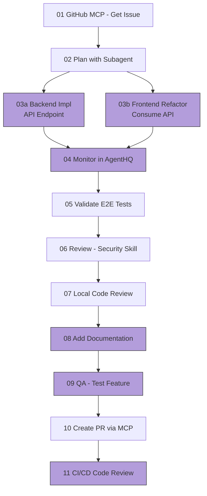

# Demo - Agentic Coding Workflow

**Pre-requisites:**
- [ ] Fork and clone the repo
- [ ] Copy this file to an ignored location like `.vscode/DEMOFLOW3.md` and open it there
- [ ] Create a GitHub issue in your forked repo with title: "Refactor superhero comparison feature to use a Backend API instead of Frontend logic", and make sure it's issue #21 - if not, update the prompts below accordingly
- [ ] No local changes, clean working tree
- [ ] Make sure Agent Skills are enabled (with the chat.useAgentSkills setting)
- [ ] Verify GitHub MCP and Playwright MCP are properly configured in mcp.json before starting: [.vscode/mcp.json](../.vscode/mcp.json)
- [ ] npx playwright install in frontend folder
- [ ] Start backend and frontend dev servers.

## What We'll Cover
We will implement a feature from idea to production using an agentic coding workflow with GitHub Copilot.
The feature is to refactor the superhero comparison logic to use a backend API instead of frontend logic.
Let's see the feature as it's currently implemented.

<div style="text-align: center;">



</div>

- [ ] **01 GitHub MCP**: List issues in GitHub using MCP
Issue name: Refactor superhero comparison feature to use a Backend API instead of Frontend logic
- [ ] **02 Create a Plan**: Create a step by step plan (with separate instructions for FE and BE) to implement the feature using Copilot subagent to do research before drafting the plan.
Save the plan to use in later steps.
Note: this allows for better, more concise context and plan quality.

    **Sample Prompt (use Plan mode):**
    ```
    Using subagents for research, analyze GitHub issue #21 "Refactor superhero comparison feature to use a Backend API instead of Frontend logic".

    Create a detailed implementation plan that should include:
    Phase 1. Backend: New /api/superheroes/compare endpoint (see prompts/10-BE-refactor-add-compare-api.md for API spec)
    Validate Backend tests pass
    Phase 2. Frontend: Refactor to consume the new API, keep UI unchanged
    Validate Frontend tests pass
    Add e2e tests to verify functionality
    ```

    📄 **Backup Plan Document**: [prompts/15-refactor-be-fe-feature-plan.md](prompts/15-refactor-be-fe-feature-plan.md)


- [ ] **03 Implement Feature using Background Agents FE/BE**: Implement the feature using Background Agents (FE + BE in parallel)

**Backend Prompt (GPT-5.2-Codex - click "Send to Background"):**
📄 Note: Use the plan created in step 2 as context: 
1. Switch to Agent + GPT-5.2-Codex
2. Enter Prompt:
```
Implement ONLY Phase 1 of the plan:
Add superhero comparison API endpoint:

Create a GET endpoint at:
/api/superheroes/compare?id1=<number>&id2=<number> 
in backend/src/server.ts
```
3. Run in the background.

**Frontend Prompt (GPT-4.1 - click "Send to Background"):**.
📄 Note: Use the plan created in step 2 as context.
1. Switch to Agent + GPT-4.1
2. Add App.js to context (if not already)
3. Enter Prompt:
```
Implement ONLY Phase 2 of the plan:
Refactor frontend to call new /api/superheroes/compare endpoint 
instead of current logic
Keep UI unchanged.
```
4. Run in the background.

- [ ] **04 Track in AgentHQ**: Look at the AGENT SESSIONS tab and track progress of the background agents
- [ ] **05 Validate Tests**: Run tests and verify all implementations work correctly.
- [ ] **06 API Security Review Skill**: Trigger the `api-security-review` skill to review the new comparison API (no need to fix)
Skill location: `.github/skills/api-security-review/SKILL.md`

**Prompt:**
```
Using the `api-security-review` skill, 
Perform a security review of the new /api/superheroes/compare endpoint
in backend/src/server.ts
```

NOTE: To verify skill is activated, you should see in Copilot output:
```
1. Searched for files matching **/skills/**, 1 match
2. Read SKILL.md file
```

- [ ] **07 Local Code Review**: Use Copilot in VS Code to perform a local code review (no need to fix)
- [ ] **08 Add Documentation**: Add documentation for the new comparison API:

1. **Send to background Agent (CLI)**
Click "Send to Background" button with this prompt:
```
Add JSDoc documentation for the superhero comparison API:
1. backend/src/server.ts - Document the /api/superheroes/compare endpoint
2. Update backend README with API usage examples
3. Add inline comments explaining comparison logic
```


2. **Demo points:**
    1. Show the worktree/session created
    2. Show the files modified
    3. Review the generated documentation
- [ ] **09 QA - Test Feature**: Use Playwright MCP to test the feature is working as described in issue.

**Prompt (Playwright-Tester mode):**
```
Use Playwright MCP to test the feature is working as described in issue #21 in GitHub.
```

- [ ] **10 Create PR with MCP**: 
Use GitHub MCP to create a Pull Request for the changes made in the feature implementation.
**Prompt:**
```
Create a PR for issue #21
Use the following details (add title and description):
- Linked Issue: #21
- Reviewers: @ofirn
- Assignees: @yoelcommit
```
- [ ] **11 Automated Code Review in GH CI**: Use Copilot to perform an automated code review in GitHub CI


---

**Key Tips & Best Practices:**
- [ ] Context: Start a NEW session for every new task/topic!
- [ ] Customize: via instructions, prompts, agents, skills
- [ ] Skills: Build and use custom skills to extend Copilot capabilities
- [ ] Agent: Use (or build) MCPs where it makes sense
- [ ] Agent: Never "Accept" until happy with result
- [ ] Agent: Restore Checkpoint
- [ ] Agent: TDD (Test Driven Dev) as Agent stop condition and feedback loop
- [ ] Agent: should run CLI commands to close feedback loop
- [ ] Coding Agent: delegate to a background agent in the cloud
- [ ] Coding Agent: Break large tasks into smaller sub-tasks
- [ ] Plan: Use subagents for research
- [ ] Review: Use AI for reviewing code, not just generating it
- [ ] CLI: For a terminal-native experience & cross-project workspaces
- [ ] Monitor: Use AgentHQ to monitor and manage background agents
- [ ] Models: Choosing the right models: https://docs.github.com/en/copilot/reference/ai-models/model-comparison